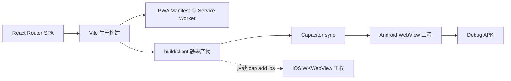
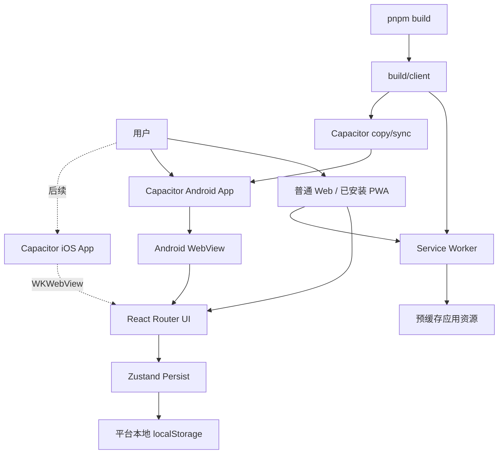

# ClassTrack PWA 与 Capacitor 移动端技术方案

> 迭代版本：v1.0  
> 需求日期：2026-09-11  
> 负责人：项目维护者  
> 总体范围：Web/PWA、Capacitor Android、Capacitor iOS  
> 本期范围：实现并验证 Web/PWA 与 Android，产出 Android Debug APK；iOS 完成兼容设计但暂不创建工程，不改造课程导入流程

## 1. 需求背景与目标收益

| 项目 | 内容 |
|---|---|
| 产品需求地址 | N/A：需求由本次对话提出 |
| iCafe 卡片地址 | N/A：个人项目暂无卡片 |
| 需求背景 | ClassTrack 当前是 React Router SPA，只能作为普通网页访问。需要在手机上支持添加到主屏幕、独立窗口和离线启动，并生成可安装的 Android APK。 |
| 目标收益 | 保留现有 Web 代码与发布方式，以一套业务代码同时支持 Web、PWA 和 Android App；完成可安装 Debug APK，给后续原生分享、通知和应用市场发布预留扩展点。 |

本期成功标准：

1. Android Chrome 和 iOS Safari 能识别 ClassTrack 为可安装 Web App；安装后以 `standalone` 模式运行。
2. 用户至少在线打开过一次后，应用外壳和已构建静态资源可离线启动；课表、出勤、备注继续使用现有本地数据。
3. PWA 更新后可由应用提示用户刷新，不静默长期停留在旧版本。
4. 同一份 Web 构建产物和平台抽象可同时支持 Capacitor Android 与后续 iOS 工程。
5. 在本地构建出可安装的 Debug APK，并记录产物位置。
6. 不改造书签脚本或教务系统课程导入流程。

## 2. 名词解释

| 名词 | Term | 含义 |
|---|---|---|
| PWA | Progressive Web App | 通过 Manifest、Service Worker 等能力，让网页可安装、独立启动并离线使用。 |
| Service Worker | SW | 运行于页面之外的缓存代理，负责静态资源预缓存、导航回退和版本更新。 |
| Capacitor | Capacitor | 将 Web 构建产物放入原生 WebView，并通过插件桥接 Android/iOS 原生能力的运行容器。 |
| WebView | Android WebView | Capacitor Android App 中承载 ClassTrack 前端页面的系统组件。 |
| Debug APK | Debug APK | 用于本地安装和测试、使用调试签名生成的 APK，不用于正式商店发布。 |

## 3. 设计目标与思路

### 3.1 实现功能

1. **PWA 安装能力**
   - 增加应用 Manifest、应用名称、主题色、显示模式和应用图标。
   - 补全 Android 与 iOS 主屏幕相关元信息。
2. **离线与更新能力**
   - 使用 `vite-plugin-pwa`/Workbox 在生产构建时生成 Service Worker。
   - 预缓存应用外壳及构建资源，导航请求回退到 SPA 入口。
   - 使用 `registerType: prompt`，在页面内提示用户更新，避免正在填写内容时被自动刷新。
3. **移动容器适配**
   - 使用动态视口高度与安全区变量适配刘海屏、底部手势区和移动浏览器工具栏。
   - 保留现有移动抽屉导航和响应式页面，不在本期重做课程表交互。
4. **Capacitor Android**
   - 初始化 Capacitor 配置和 Android 原生工程。
   - 将 React Router SPA 的客户端构建目录配置为 `webDir`。
   - 增加 Web 构建、同步 Android 和构建 APK 的 pnpm 脚本。
5. **Capacitor iOS 兼容预留**
   - 共用 `capacitor.config.ts`、Web 构建产物与平台能力抽象，避免 Android 专属逻辑侵入业务层。
   - Manifest、主题色、安全区和动态视口同时考虑 iOS Safari/PWA 与 WKWebView。
   - 本期不执行 `cap add ios`，不创建 Xcode 工程，也不产出 IPA。
6. **构建与验收**
   - 执行类型检查、Lint 和生产构建。
   - 执行 Capacitor 同步及 Gradle Debug 构建，得到 APK。

### 3.2 系统目标

#### 3.2.1 业务目标

- 降低手机用户使用门槛：访问一次后可从桌面图标启动。
- 通过 APK 支持内部试用、演示和 Android 真机验证。
- 保持 Web 与 Android 功能一致，不建立第二套业务代码。

#### 3.2.2 技术目标

- PWA 生产构建必须生成 Manifest 和 Service Worker。
- 离线模式下不得依赖远程后端才能读取现有课表数据。
- Android 工程必须能消费同一次 `pnpm build` 的静态产物。
- Web、PWA、Capacitor Android 和后续 Capacitor iOS 共用 Zustand 状态模型和 React 页面。
- 不引入远程 API、数据库、账号系统或云同步。

## 4. 设计原则

- **单一代码源**：业务 UI 和状态逻辑只在 `app/` 中维护。
- **渐进增强**：不支持 PWA 的浏览器仍可作为普通网页使用。
- **更新可控**：Service Worker 下载新版本后由用户确认刷新。
- **本地优先**：保持现有 `localStorage` 数据模型，本期不做高风险迁移。
- **平台边界清晰**：PWA 与 Android App 的本地存储彼此独立，通过现有 JSON 备份能力迁移。
- **可回滚**：PWA、Capacitor 配置与 Android 工程均为增量文件，不修改课程数据格式。

## 5. 系统环境

### 5.1 模块依赖

| 依赖 | 功能点 | 依赖方式 | 稳定性要求 | 维护方 |
|---|---|---|---|---|
| `vite-plugin-pwa` | 生成 Manifest、Service Worker 和注册逻辑 | 构建期依赖 | 构建失败时不得发布 | 项目维护者 |
| Workbox | 静态资源预缓存与导航回退 | 由 PWA 插件集成 | 缓存版本应与构建一致 | Google/社区 |
| `@capacitor/core` | Web 与原生运行时桥接 | 运行时依赖 | 与 Capacitor CLI/Android 主版本一致 | Ionic |
| `@capacitor/cli` | 初始化、同步原生工程 | 开发依赖 | 构建工具 | Ionic |
| `@capacitor/android` | Android 原生容器 | 原生依赖 | 与 Core 主版本一致 | Ionic |
| `@capacitor/ios` | iOS 原生容器 | 后续迭代依赖，本期不安装 | 与 Core 主版本一致 | Ionic |
| Android SDK/JDK/Gradle | 构建 Debug APK | 本地构建环境 | 版本满足 Capacitor 要求 | 本机环境 |



## 6. 模块设计

### 6.1 模块架构及说明

**当前逻辑**

- `react-router.config.ts` 通过 `ssr: false` 使用 SPA 模式。
- `vite.config.ts` 目前仅注册 Tailwind 和 React Router 插件，没有 PWA 插件。
- `app/root.tsx` 只配置基础 viewport 和标题，没有 Manifest、主题色和 Apple 主屏幕元信息。
- `app/store/index.ts` 使用 Zustand persist 将核心课表数据保存在 `localStorage`。
- `app/features/layout/AppLayout.tsx` 使用 `h-screen`，移动设备上可能受浏览器动态工具栏和安全区影响。
- 项目不存在 `capacitor.config.ts`、`android/` 工程或 Capacitor 构建脚本。

**目标架构**



**变更说明**

- `vite.config.ts`：注册 `VitePWA`，定义 Manifest、Workbox 缓存和开发环境策略。
- `app/root.tsx`：增加主题色、Manifest/Apple 元信息，并挂载更新提示组件。
- `app/components/pwa/PwaUpdatePrompt.tsx`：注册 Service Worker，显示“发现新版本”提示并由用户触发更新。
- `app/app.css` 与 `app/features/layout/AppLayout.tsx`：增加动态视口和安全区适配。
- `public/`：增加多尺寸应用图标和 Apple Touch Icon。
- `capacitor.config.ts`：配置跨 Android/iOS 共用的 App ID、名称和 `webDir: 'build/client'`。
- `package.json`：增加 PWA/Capacitor 精确版本依赖与 Android 构建脚本。
- `android/`：由 Capacitor CLI 生成并纳入版本管理的原生工程。

### 6.2 数据结构及说明

#### 6.2.1 数据库设计

N/A：本期不增加数据库，所有课程与应用状态继续存储在现有 Zustand `localStorage` 中。

#### 6.2.2 缓存设计

N/A：本期不使用 Redis。Service Worker 浏览器缓存属于客户端资源缓存，不是业务数据缓存。

客户端缓存策略：

| 资源 | 策略 | 原因 |
|---|---|---|
| Vite 指纹化 JS/CSS/字体 | Precache / Cache First | 文件名含内容哈希，可长期安全缓存。 |
| SPA 导航 | App Shell 回退 | 离线访问任意前端路由时返回构建入口。 |
| Manifest/图标 | Precache | 确保安装信息和图标稳定可用。 |
| 外部教务请求 | 不配置运行时缓存 | 本期不调整课程导入，也不应缓存登录态接口。 |
| 用户课程/出勤/备注 | Zustand `localStorage` | 沿用现有数据模型，避免迁移风险。 |

### 6.3 关键技术点

#### React Router SPA 构建目录

React Router 的客户端产物为 `build/client`。Capacitor 的 `webDir` 必须指向该目录，否则 `cap sync` 无法复制入口文件。

#### Service Worker 更新

采用提示更新模式：新 Worker 安装后等待，UI 展示提示；用户点击后调用更新函数并刷新页面。这样可避免自动刷新中断备注编辑或导出操作。

#### PWA 与 Capacitor 的职责边界

- 浏览器/PWA 使用 Service Worker 负责离线资源。
- Capacitor Android APK 和后续 iOS App 将静态资源直接打包进安装包，即使无网络也能启动。
- 两个平台继续使用各自容器的 `localStorage`，默认不互通。
- 本期不接入 Capacitor Filesystem、Share、Notifications 等插件；仅预留后续平台能力扩展点。
- 新增原生能力时必须经过统一 TypeScript 适配层按 Web/Android/iOS 分发，不允许业务组件直接写 Android 专属实现。

#### iOS 兼容设计与本期边界

- Web/PWA 元信息同时配置 `apple-mobile-web-app-capable`、状态栏样式和 Apple Touch Icon。
- 页面使用 `env(safe-area-inset-*)` 与动态视口单位，兼容 iPhone 刘海、灵动岛和底部手势区。
- Capacitor 配置不使用 Android 独占的远程 URL、明文流量或路径假设。
- 后续 iOS 阶段安装与 Core 同版本的 `@capacitor/ios`，执行 `pnpm exec cap add ios`、`pnpm exec cap sync ios`，再通过 Xcode 完成签名和真机验证。
- 本期不创建 `ios/` 目录、不构建 IPA、不处理 Apple Developer 证书和 App Store 审核。

#### Android 标识与版本

- App ID：`com.classtrack.app`（已确认）
- App Name：`ClassTrack`
- 初始 Android `versionName`/`versionCode` 使用生成工程默认值；正式发布前改为项目版本策略。
- 本次产出 Debug APK；Release 签名、AAB 与商店资料不在本期范围。

#### 应用图标

以现有 `public/favicon.ico` 作为唯一图标源（已确认），不重新设计图标。开发时从该文件生成 PWA 和 Android 所需的派生资源：

- PWA：至少提供 192×192、512×512 PNG，并生成适用于 `maskable` 的留白版本。
- Android：生成 `mipmap-*` 多密度启动器图标及自适应图标资源。
- `public/favicon.ico` 保持不变，继续作为浏览器 favicon。

派生图标只做尺寸、格式和安全区适配，不改变原图主体设计；生成后检查透明通道、圆形/圆角矩形裁切和小尺寸可读性。

### 6.4 接口设计

N/A：本期不新增或修改 HTTP/RPC 接口。Manifest、Service Worker 和 Capacitor Bridge 均属于客户端能力，不构成业务接口。

### 6.5 非功能性需求设计

#### 6.5.1 安全设计

- **越权风险**：N/A，无账号和远程数据访问新增。
- **SQL 注入**：N/A，无数据库。
- **XSS/CSRF**：PWA 不改变现有渲染链路；不缓存教务登录接口，不新增动态脚本来源。
- **Service Worker 范围**：仅控制应用自身 origin；生产环境必须使用 HTTPS，localhost 调试除外。
- **敏感信息**：不在 Manifest、Capacitor 配置和 Android 资源中写入密钥；课程数据仍保存在用户设备。
- **隐私数据**：不新增采集、传输或第三方统计；卸载 App、清除站点数据仍可能删除本地课程数据，需继续依赖 JSON 备份。
- **原生网络策略**：不放宽 Android 明文流量，不增加任意域名白名单。

#### 6.5.2 性能与运维设计

- **性能影响**：首次访问增加 Service Worker 注册和缓存写入；后续启动主要从本地缓存读取，预计更快。
- **构建约束**：`pnpm typecheck`、`pnpm lint`、`pnpm build` 和 Android Gradle 构建必须通过。
- **缓存观测**：开发者工具验证 Manifest、Service Worker 状态、离线导航和更新生命周期。
- **降级方案**：Service Worker 注册失败时继续作为普通 SPA 使用；Capacitor 构建失败不影响 Web 发布。
- **日志**：PWA 注册失败只在开发环境记录必要错误，不输出用户课程数据。

## 7. 统计方案

N/A：本期不接入统计 SDK，避免引入隐私与网络依赖。安装率、离线启动率等指标待有合规统计方案后再设计。

## 8. 上线、构建与回滚方案

### 8.1 实施顺序

1. 添加精确版本的 PWA 与 Capacitor 依赖。
2. 配置 Manifest、Service Worker、图标和更新提示。
3. 完成动态视口与安全区适配。
4. 执行 Web 类型检查、Lint 和生产构建。
5. 初始化并同步 Capacitor Android 工程。
6. 使用 Gradle 构建 Debug APK。
7. 在 Android 真机或模拟器安装验证。

### 8.2 构建命令

```bash
pnpm typecheck
pnpm lint
pnpm build
pnpm cap:sync:android
pnpm cap:build:android
pnpm cap:install:android
```

预期 APK：`android/app/build/outputs/apk/debug/app-debug.apk`。

改完代码后如果只要验证真机效果，直接执行：

```bash
pnpm cap:install:android
```

该命令会构建 Debug APK、覆盖安装到已连接的 Android 手机，并重新打开 ClassTrack。需要本机配置完整 JDK 21、Android SDK，以及已授权 USB 调试的设备。

### 8.3 上线前检查

- Manifest 可被浏览器读取，名称、图标、启动 URL 和显示模式正确。
- Service Worker 已激活，断网刷新已访问页面能够启动。
- 更新提示可以完成 Worker 激活和页面刷新。
- iPhone/Android 安全区没有遮挡主要操作。
- Android 构建不依赖未提交的绝对路径或本机密钥。
- Debug APK 可以安装并启动，路由切换与 `localStorage` 持久化正常。
- 课程导入、导出、PDF/DOCX 至少完成一次 Android 真机回归；导入流程本身不改造。

### 8.4 回滚方案

1. Web 回滚：部署上一个版本的静态资源；旧 Service Worker 检测到旧构建后替换缓存。
2. PWA 紧急停用：移除 PWA 插件并发布新版本，同时保留注销旧 Service Worker/清理旧缓存的迁移代码至少一个版本。
3. Android 回滚：重新构建并分发上一版本 APK；正式商店阶段需提高 `versionCode` 后发布回滚版本。
4. 数据修复：本期不改变业务数据结构，正常回滚不会迁移或删除 `localStorage` 数据；异常时使用现有 JSON 备份恢复。

## 9. 风险评估

| # | 风险描述 | 类型 | 应对措施 | 负责人 |
|---|---|---|---|---|
| 1 | Service Worker 缓存旧资源导致页面版本不一致 | 技术 | 使用指纹资源、提示更新模式；上线验证更新生命周期。 | 项目维护者 |
| 2 | PWA、浏览器与 APK 的本地数据互不相通 | 业务 | 明确平台边界，保留 JSON 导入导出；后续再设计云同步。 | 项目维护者 |
| 3 | iOS 对 PWA 存储、下载和后台能力限制较多 | 技术 | 本期仅承诺安装、独立启动和本地页面离线；真机验证文件操作。 | 项目维护者 |
| 4 | PDF/Word 下载在 Android WebView 中体验不稳定 | 技术 | 本期先回归现状；后续接入 Capacitor Filesystem/Share 插件。 | 项目维护者 |
| 5 | JDK 或 Android SDK 不满足 Capacitor 要求，无法产 APK | 构建 | 构建前检查环境；使用生成工程的 Gradle Wrapper；记录缺失依赖和安装要求。 | 项目维护者 |
| 6 | React Router 构建目录与 Capacitor `webDir` 不一致 | 技术 | 固定使用 `build/client`，在同步脚本前执行生产构建。 | 项目维护者 |
| 7 | 纯 WebView 应用不满足商店审核要求 | 业务 | 本期只产 Debug APK；正式上架前增加原生分享/通知和完整隐私材料。 | 项目维护者 |
| 8 | 当前书签脚本课程导入在手机端不友好 | 业务 | 已明确排除在本期，不对移动端一键导课作承诺。 | 项目维护者 |

## 10. 本期范围边界与后续演进

本期不包含：课程导入重构、账号登录、云同步、推送通知、系统日历、原生文件分享、iOS 原生工程及 IPA、Release 签名、AAB、应用商店上架。iOS 的 Web/PWA 兼容和 Capacitor 接入约束属于本期设计范围。

建议后续顺序：

1. Android 真机验证完成后，接入 Capacitor Share 与 Filesystem，改善代课 PDF/Word 分享。
2. 增加课程本地通知和系统日历写入，但需先设计授权与撤销机制。
3. 数据规模或稳定性需要提升时，将原生容器存储抽象为 Preferences/SQLite，同时提供 `localStorage` 一次性迁移。
4. 明确上架目标后，再增加 iOS 工程、Release 签名、隐私清单、AAB 和商店素材。

## 质量检查清单

**结构完整性**

- [x] 所有必填章节均有实质性内容。
- [x] 可选章节不适用时已写明 N/A 原因。

**数据库与缓存规范**

- [x] N/A：不涉及数据库 DDL。
- [x] N/A：不涉及 Redis。
- [x] 已单独说明客户端 Service Worker 缓存策略。

**接口规范**

- [x] N/A：不新增 HTTP/RPC 接口。

**安全与质量**

- [x] 已完成越权、注入、XSS/CSRF、敏感信息和隐私数据评估。
- [x] 所有实现描述精确到目标文件与能力。
- [x] 上线、构建和回滚步骤可执行。
- [x] 保持 pnpm 作为项目包管理器。
